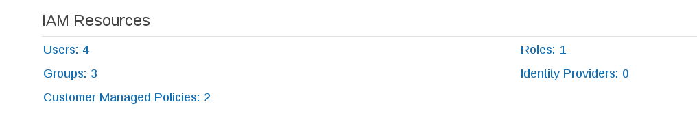
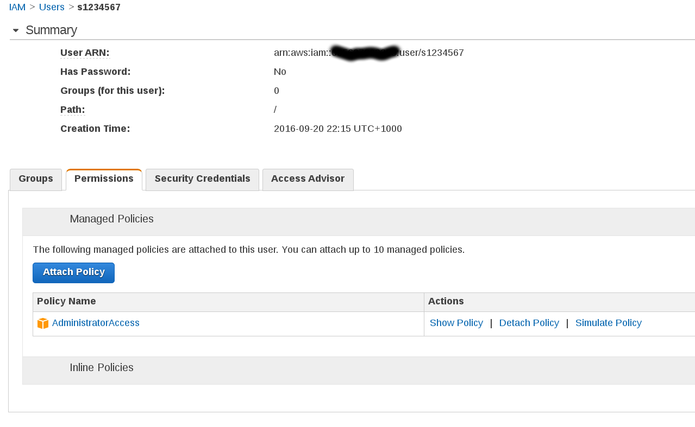

# Create an IAM User

### Sign into the AWS Console and select IAM

### Click Users

### Click Create New User

### Create a new user called sXXXXXXX (make sure to tick Generate Keys)

### Store the keys in a safe place

### Click on your new user, click Permissions, Click Attach Policy and attach the AdministratorAccess one

